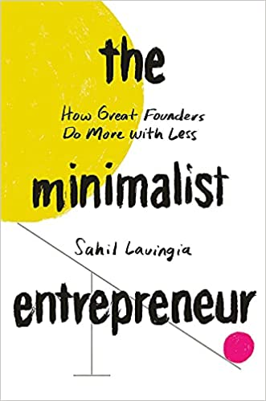
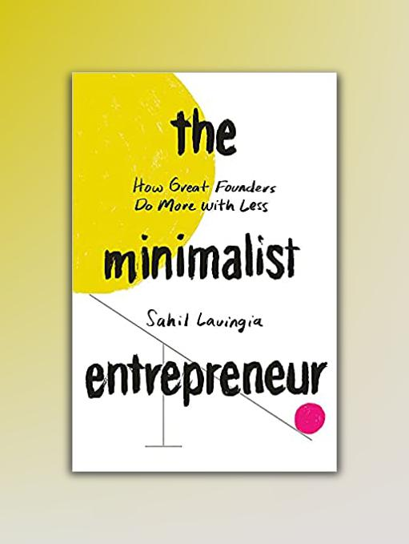
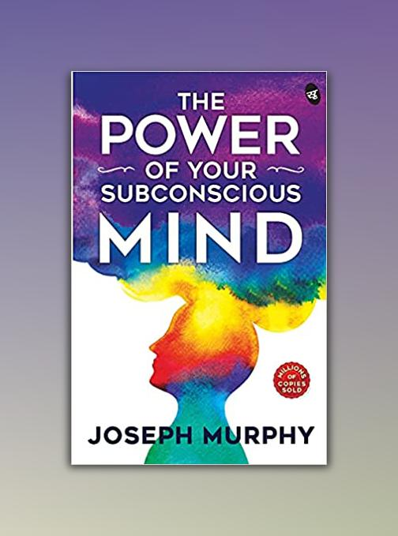

# Image Background Gradient
Python implementation of generating image background gradient using colors in image.

## Modules used - 
1. PIL(pillow)
2. os

## Sample Input -

  
  &nbsp;&nbsp;
  
  &nbsp;&nbsp;
  
  &nbsp;&nbsp;
  

## Output -

  
  &nbsp;
  
  &nbsp;
  
  &nbsp;
  

